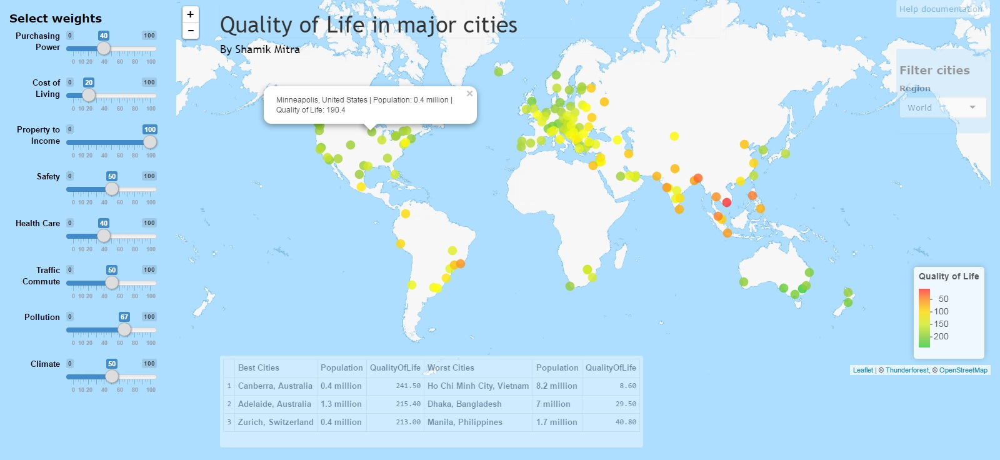
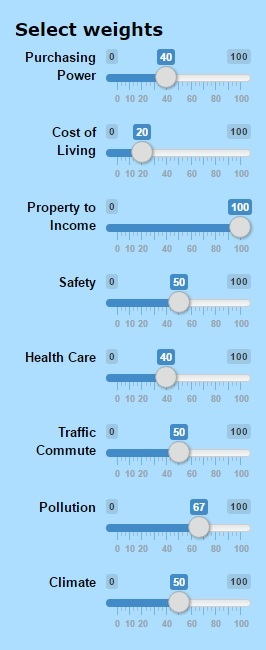
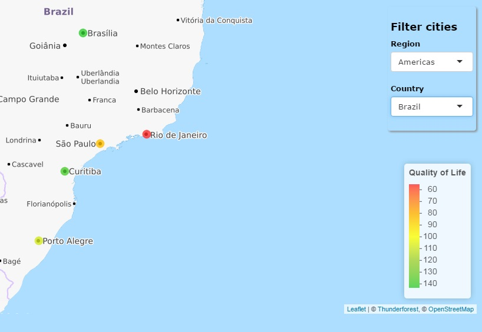
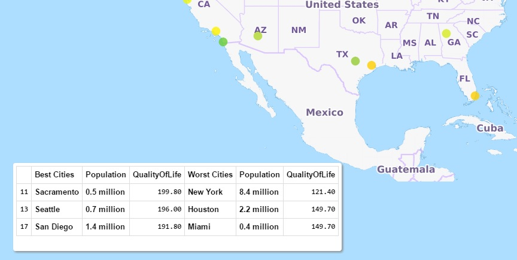

This application can be used to see the Quality of Life index for 143 major cities in the world. The application has 4 main areas.
 
At the center, you will see the map with the cities highlighted. Each city is color coded from green to red with green being the color with the highest Quality of Life index. Click on a city to see the details about that city.

On the left, you will see the different weights used to calculate the Quality of Life index. Changing the weights will change the index real time. For example, if you are interested in just stacking the cities by, let say, the Cost of Living, then make the weight for that 100% and the weight for all the others 0%.

On the right, you will see a drop down that you can use to filter the cities. First select a region, and then if you want, select a country.

On the bottom, you will see the list of the 3 best and 3 worst cities. Note that if you have selected a specific region or country that has less than 6 cities, then this table will just show the list of those cities.

#Have fun!
